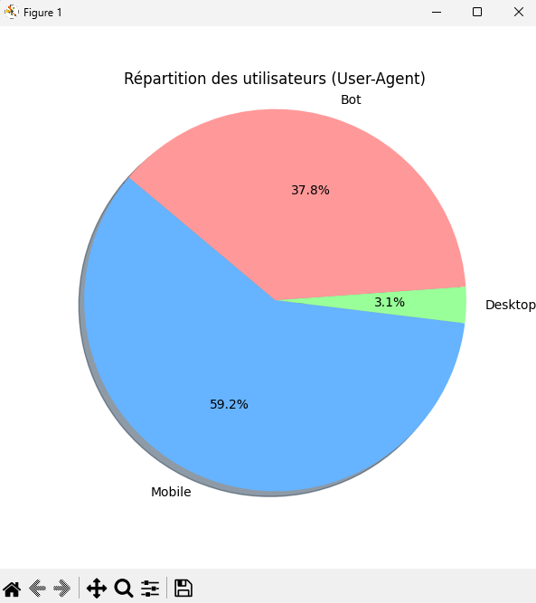
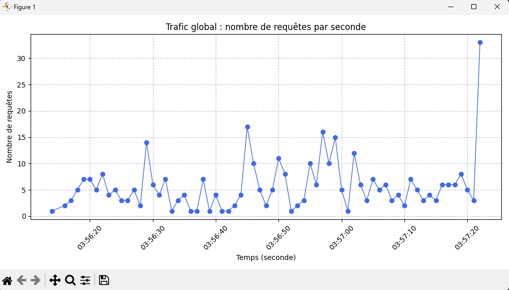
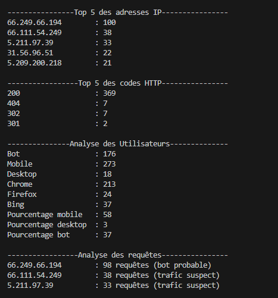

# Projet: Analyse de Log Apache
Analyseur de logs Apache en Python — parsing, analyse data, détection de DDoS, bots et génération de graphiques avec Matplotlib.

# Projet : Analyse automatique de logs Apache

Ce projet a été développé dans le cadre d'éducation personelle.
Il a pour objectif d’automatiser l’analyse de **logs de serveurs web Apache**, afin de :
- comprendre ce qui se passe sur le serveur,  
- détecter les comportements anormaux (bots, attaques, erreurs HTTP, etc.),  
- extraire des statistiques utiles (trafic, navigateurs, codes HTTP),  
- et visualiser les résultats sous forme de graphiques clairs.

---

## Fonctionnalités principales

-  **Lecture et parsing** des fichiers de logs Apache au format standard  
-  **Analyse statistique :**
  - Top 5 des adresses IP les plus actives  
  - Top 5 des codes HTTP les plus fréquents  
  - Répartition des utilisateurs (Mobile, Desktop, Bot)  
-  **Détection d’anomalies :**
  - Détection de pics d’activité suspects (possible attaque DDoS)
  - Identification de bots à partir du User-Agent  
-  **Visualisation des données :**
  - Graphique du trafic par seconde  
  - Évolution du nombre de requêtes par IP  
  - Histogramme des IP suspectes

---

##  Aperçu

Quelques exemples d’exécutions du programme :

| Analyse des utilisateurs | Requêtes par IP |
|---------------------------|----------------|
|  |  |

> *(Les graphiques sont générés automatiquement via Matplotlib)*

---

##  Technologies utilisées

-  Python 3.12  
-  `matplotlib` pour la visualisation des données  
-  `collections` (`Counter`, `defaultdict`) pour le traitement statistique  
-  `datetime` pour la gestion temporelle et la détection de pics d’activité

---

##  Organisation du projet

| Fichier | Description |
|----------|--------------|
| `main.py` | Script principal contenant l’analyse complète |
| `logApache.txt` | Exemple de fichier de logs Apache |
| `requirements.txt` | Liste des dépendances nécessaires |
| `images/` | Captures d’écran et graphiques illustratifs |

---

## Execution du projet

### Installation des dépendances
Assurez vous d'avoir python 3 installé ainsi que les bibliothèques
Puis exécutez simplement le script python "main.py"

### Exemple des informations extraite

## Ameliorations futures
- Intégration de Plotly pour des graphiques interactifs
- Exports des statistiques en CSV ou en Excel
- Analyse en temps réel des logs via un flux continu
